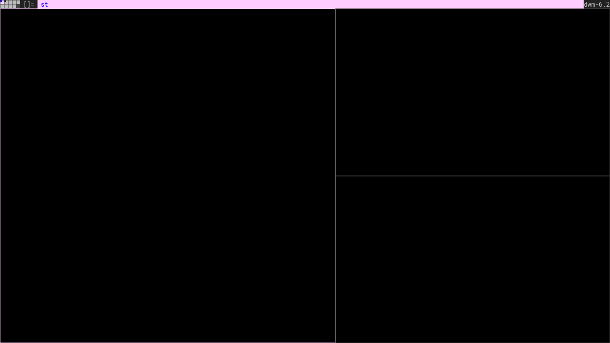
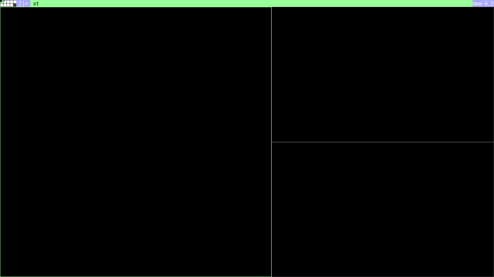
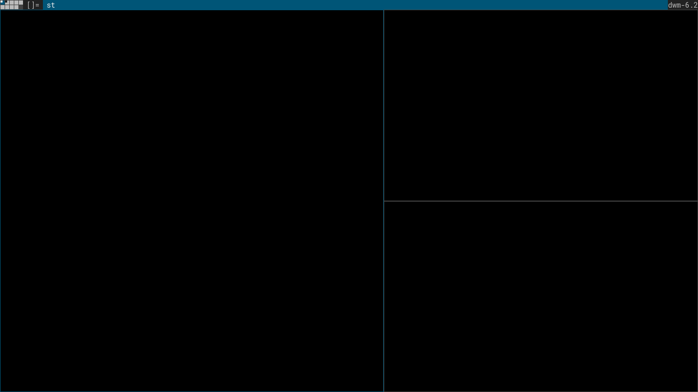

# dwm-html
**[dwm-html](https://dreadsd.github.io/dwm-html/)** is a static page that aims
to recreate the basic dwm layout with the taggrid patch. Made for color
customization purposes.

## Screenshots




## Installation
```sh
git clone https://github.com/dreadsd/dwm-html.git
cd dwm-html
```
Open the index.html file with one of the following browsers.

## Support
This is a general grid and flexbox browser support, check yours.
|Browser|Version|
|-------|-------|
|Chrome | > 57  |
|Firefox| > 52  |
|Edge   | > 16  |
|Safari | > 10.1|
|Opera  | > 12.1|

## To do
I don't know if I want to add a dynamic color change with JavaScript, I like
the concept of a static page with changes in the development tools.

## License
[MIT](https://opensource.org/licenses/MIT)
